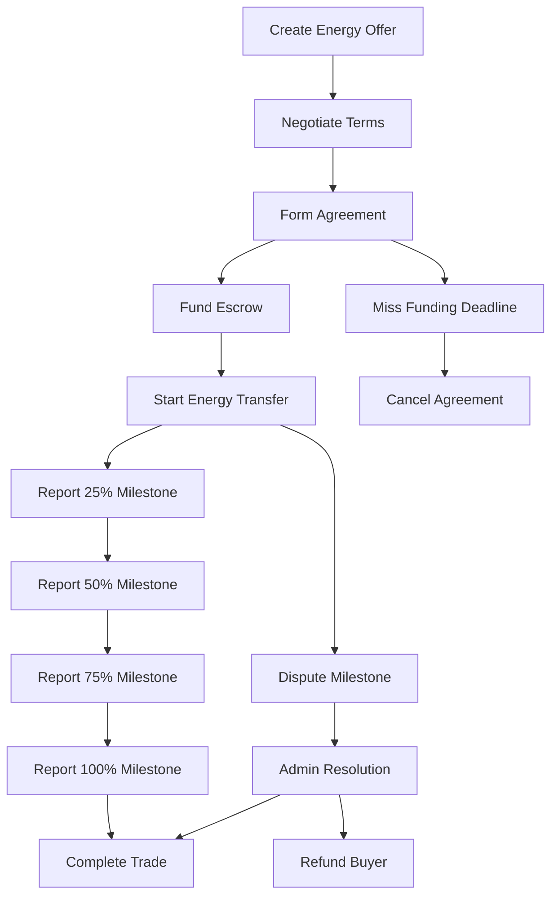

# ⚡ Equilux Energy 

> *Decentralized energy trading powered by blockchain technology*


<p align="center">
  
</p>

## 🔋 Overview

Equilux Energy is a revolutionary peer-to-peer energy trading platform that leverages blockchain technology to create a decentralized marketplace for renewable energy. Our platform connects energy producers directly with consumers, eliminating intermediaries and enabling a more efficient, transparent, and sustainable energy ecosystem.

## ✨ Key Features

| Feature | Description |
|---------|-------------|
| 🔄 **P2P Trading** | Direct trading between energy producers and consumers |
| 🏪 **Transparent Marketplace** | Browse and respond to energy offers with full transparency |
| 💬 **Advanced Negotiation System** | Negotiate terms, prices, and energy amounts directly with counterparties |
| 🔒 **Secure Escrow System** | Funds held in smart contract escrow until energy delivery milestones are met |
| 📊 **Milestone-Based Delivery** | Track energy delivery progress with 25%, 50%, 75%, and 100% milestones |
| ⚖️ **Integrated Dispute Resolution** | Built-in mechanisms for fair dispute resolution with moderator oversight |
| 👥 **Role-Based Permissions** | Distinct roles for users, moderators, and administrators |
| ⏱️ **Time-Bound Agreements** | Agreements with automated funding deadlines and delivery timeframes |

## 🧠 Smart Contract Architecture

Equilux Energy is built on three main Ethereum smart contracts:

```
┌──────────────────┐     ┌──────────────────┐     ┌──────────────────┐
│ EnergyMarketPlace│◄────┤   EnergyEscrow   │◄────┤   EnergyToken    │
│                  │     │                  │     │                  │
│ - Offers         │     │ - Fund holding   │     │ - ERC20 token    │
│ - Negotiation    │     │ - Milestone      │     │ - Payment        │
│ - Agreements     │     │   payments       │     │   mechanism      │
│ - Milestones     │     │ - Dispute        │     │                  │
└──────────────────┘     └──────────────────┘     └──────────────────┘
```

## 🔧 Technical Details

Built with industry best practices:

- **Solidity 0.8.17+**: Latest security features and optimizations
- **OpenZeppelin Contracts**: Industry-standard implementations
  - AccessControl: Role-based permission system
  - ReentrancyGuard: Protection against reentrancy attacks
  - Ownable: Secure ownership model
  - Pausable: Emergency circuit breaker pattern
- **Escrow Pattern**: Secure funds management during the trade lifecycle
- **Event-Driven**: Comprehensive event emissions for off-chain tracking
- **Gas Optimization**: Efficient data structures and algorithms

## 💻 Installation & Setup

### Prerequisites

- Node.js v14+
- npm or Yarn
- MetaMask or other Ethereum wallet
- Hardhat development environment

### Quick Start

```bash
# Clone the repository
git clone https://github.com/equilux-energy/smart-contracts.git
cd equilux-energy

# Install dependencies
npm install

# Create .env file
echo "PRIVATE_KEY=your_private_key
INFURA_API_KEY=your_infura_key
ETHERSCAN_API_KEY=your_etherscan_key" > .env

# Compile contracts
npx hardhat compile

# Run tests
npx hardhat test

# Deploy to testnet
npx hardhat run scripts/MasterDeploymentScript.js --network goerli
```

## 🌊 Energy Trading Flow



## 🔐 Security Features

Equilux Energy prioritizes security with:

- **Time-locked Dispute Resolution**: 24-hour window to dispute milestone completions
- **Multi-role Access Control**: Separation of user, moderator, and admin permissions
- **Emergency Pause**: Circuit-breaker functionality for critical issues
- **Non-reentrant Functions**: Protection against reentrancy attacks
- **Funding Deadlines**: Automatic cancellation of unfunded agreements
- **Event Logging**: Comprehensive event trail for auditing

## 🤝 Contribution Guidelines

We welcome contributions! Please follow these steps:

1. Fork the repository
2. Create your feature branch (`git checkout -b feature/amazing-feature`)
3. Commit your changes (`git commit -m 'Add some amazing feature'`)
4. Push to the branch (`git push origin feature/amazing-feature`)
5. Open a Pull Request

## 📜 License

This project is licensed under the MIT License - see the LICENSE file for details.

## 📞 Contact & Support

- **Email**: equilux.energy.dev@gmail.com

---

<p align="center">
  <sub>Powering a sustainable future, one transaction at a time</sub>
</p>

